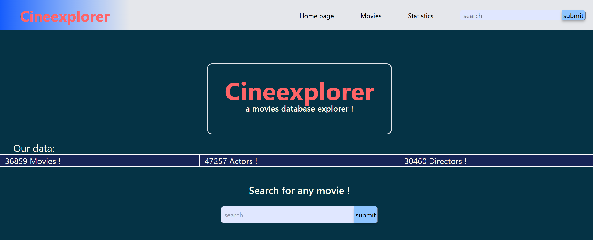
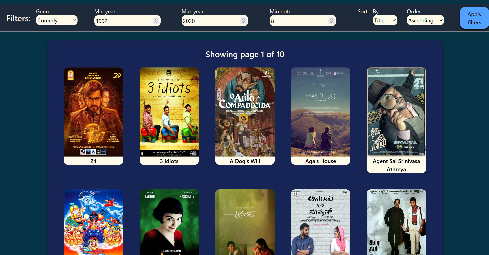
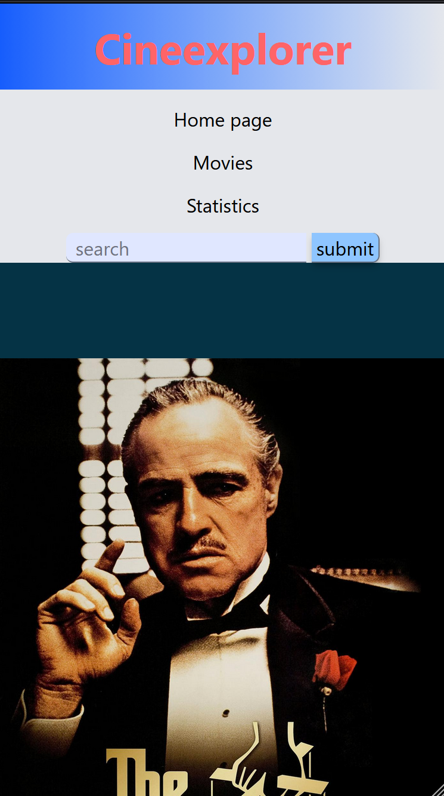
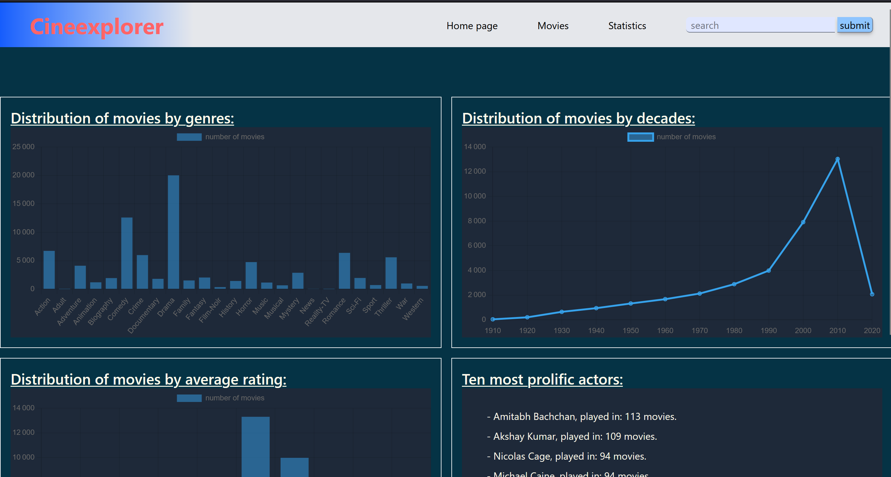

# Cineexplorer
A movies database explorer.

## About 
### The app
Cineexplorer is a web-application in which you can browse through a vast array of movies, by filtering them or via textual search. It also allows you to see more in depth-details about any movie you like and more !

### The context

This project was done as a learning assignement as part of the advanced databases class at Polytech Marseille.
It's goal was to create a multi-base application communicating with both a SQL and No-SQL database.

## Technological stack

This full stack application was made in python using django, with tailwind-css for the styling, and relies on a SQLite DB and mongoDB replica set to query it's data.

## Building

The raw data can be downloaded from https://datasets.imdbws.com/, however the data may need some preprocessing, as the original data this was created from was already altered. The different databases can then be created from the various scripts located in the "script" repository.

## Screenshots

### Movies page:

### Mobile view:

### Stats page:
